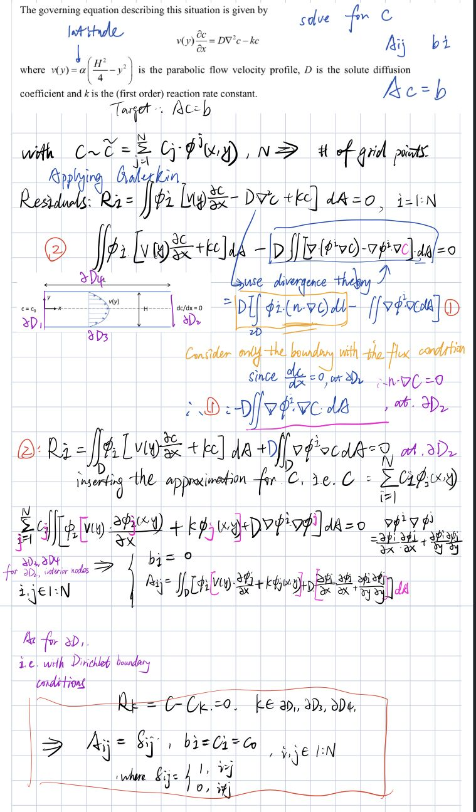
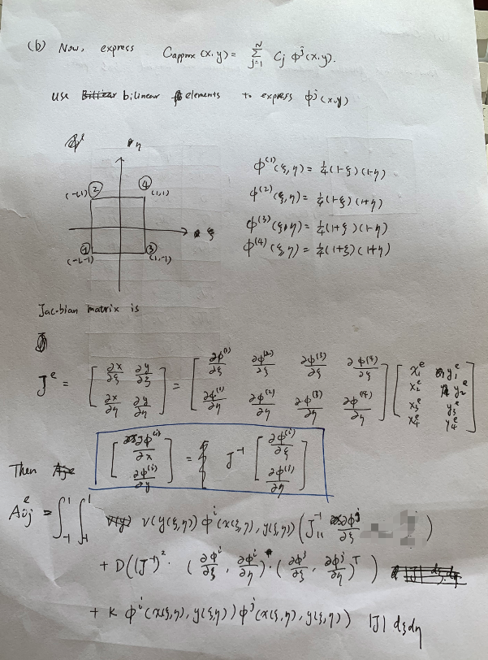
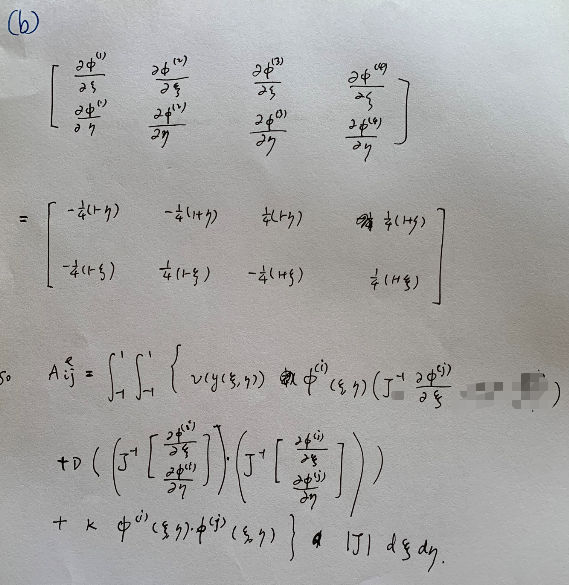
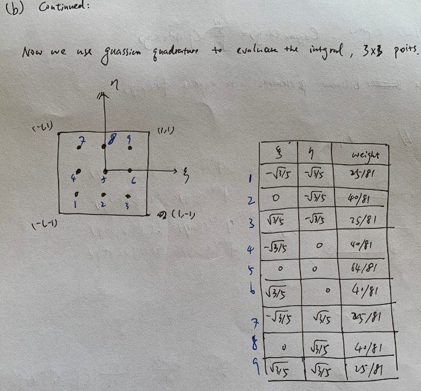
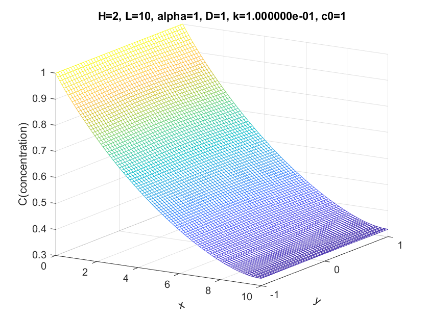
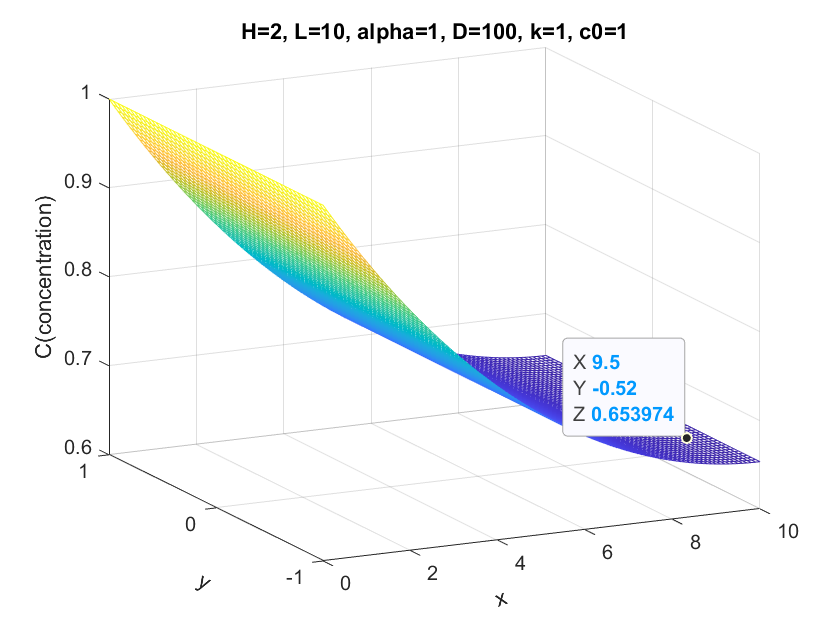
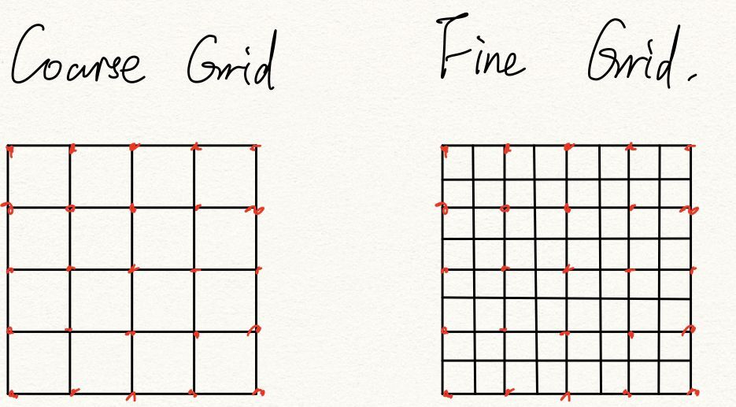
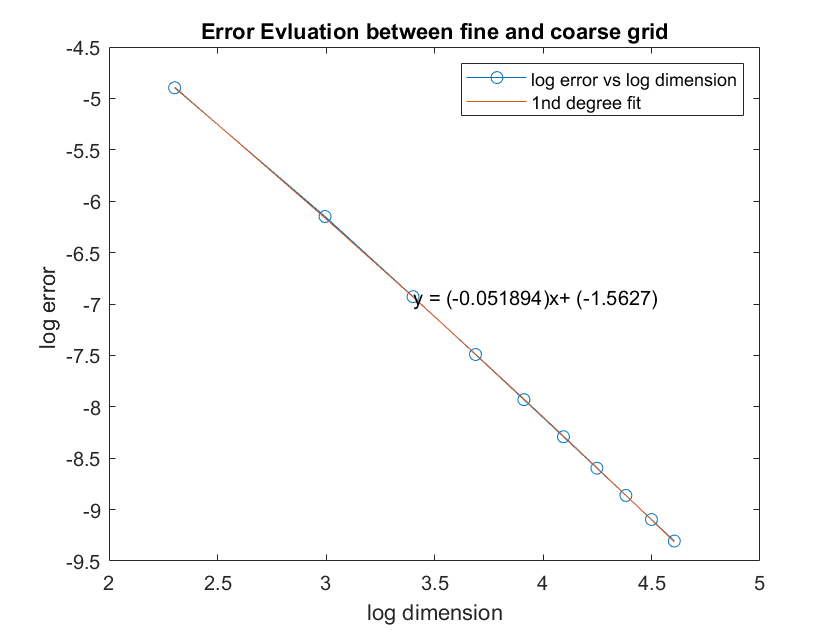
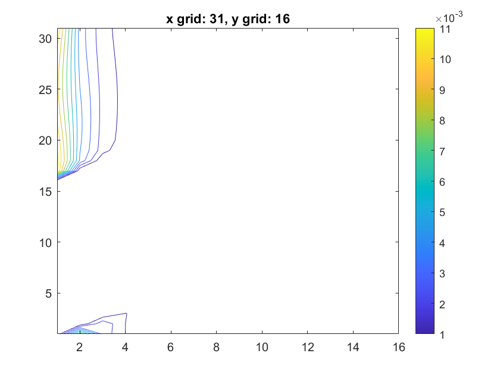
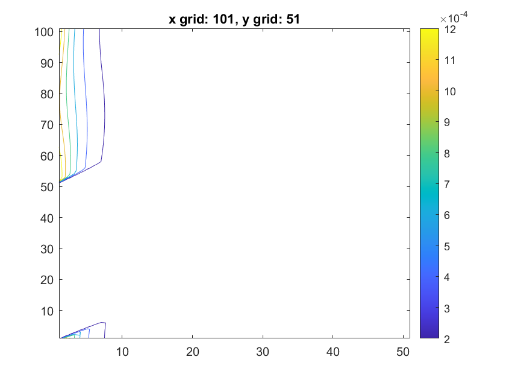

# ENM502-2021-hw4
#### Introduction

The **finite element method** (**FEM**) is a widely used method for numerically solving [differential equations](https://en.wikipedia.org/wiki/Differential_equation) arising in engineering and [mathematical modeling](https://en.wikipedia.org/wiki/Mathematical_models). In this homework, we are going to simulate a reactive solute(a fully developed parabolic flow) in a rectangular channel with **FEM**.

The equation of the flow could be described as 
$$
v(y) \frac{\partial c}{\partial x}=D \nabla^{2} c-k c
$$
where `v` is is the parabolic flow velocity profile
$$
v(y)=\alpha\left(\frac{H^{2}}{4}-y^{2}\right)
$$
`D` is the solute diffusion coefficient and `k` is the (first order) reaction rate constant. 

#### Problem Setup and Formulation Finite Element Method

Here we briefly introduce the steps of finite element method(**FEM**). See the detailed equation in next two sessions.

1. Derive the **Weak form** by applying the **Galerkin's** method
2. Use **FEM** to divide the whole grid into elements with unit grid. Write the whole integration into integration of each elements
3. Use bilinear elements and express all integrals in terms of integrals over the unit element.
4. Use `3x3` **Gaussian quadrature** to evaluate the integral.

#### Problem Setup and Formulation Weak form of PDE

Here we derive the **weak form** in the form of handwriting.

（made by @[Ling Xie](https://github.com/Jack12xl))

#### Problem Setup and Formulation Gaussian Quadrature

Here we derive the **Gaussian Quadrature** in the form of handwriting.

| Discuss the basis function, the Jacobin matrix(used to map from global to unit element). |
| ------------------------------------------------------------ |
|                                |
| Plug in the weight and basis functions                       |
|                                |
| The layout of the gauss quadrature.                          |
|                                |

（made by @[Siyu Zhao](https://github.com/siyuzhao98))

#### Result and Discussions Plots and comparison between different parameters

The basic condition is ` α = 1; D = 1; k = 1 H = 2 and L = 10`

| On the bath case, the concentration gradually goes down along the x-axis and becomes zero in the end. |
| ------------------------------------------------------------ |
|                                   |
| When the speed goes up, the fluid takes longer distance along x-axis before fading to zero concentration. |
|                                  |
| When the reaction rate is low, the fluid takes longer to reach to concentration zero. |
|                                    |
| When the diffusion is high, the fluid looks more viscous. So it is very diffusive along the x-axis. |
|                                    |

#### Result and Discussions(Accuracy)

Here we define the solution error as the **L2-norms** between the fine grid and coarse grid.

##### Define the error

Given a coarse grid and a fine grid, which represents the field under different resolution, we calculate the **L2-norms** between the same place on each grid(the red dot). Under this setting, we could save interpolation step without losing too much accuracy.

In our expectation and knowledge of error, the error `e` basically follows `C*h^P`, where `h` is our case could be the dimension of the grid, `D` , `k`, `C` and `P` are both constant. 

So we change the dimension of the grid(but keeping the ratio of each grid), use the finer grid as the leading groundtruth to calculate the error of the coarse grid.  

Here we basically show the discrepancy map compared to the ground truth(finer grid).

|  |  |
| ------------------------------- | -------------------------------- |
|                                 |                                  |

To our surprise, the difference map isn't symmetric along x or y axis. But as expected, the higher the grid dimension is, the more accurate the results would be.

##### Extra credits(use FDM method compare )

As required, here we use the FDM method to judge whether the result is relatively right.

As we already know, compared to **FEM**, **FDM** is older and is based upon the local **Taylor expansion** to approximate the differential equations. It has difficulties handling complex geometries(e.g. circles, or places like boundary). But it has **less computation cost** compared to **FEM**.

Here we show the difference heatmap between our FEM and FDM results

They are both under conditions of ` α = 1; D = 1; k = 1 H = 2 and L = 10`

As expected, the boundries show a bigger discrepancy, since in **FDM** the boundries are ill-defined. On the other hand, the left side(where the reaction starts) shows a bit difference. This is probably due to the inaccuracy of the **FDM** method. 

Basically, the results show discrepancies under the tolerance, which justifies the correctness of the **FEM** results. 

#### Conclusion

1. **FEM** Computationally expensive but more accurate compared to **FDM**. 
2. FEM error mainly contrate on the upper left and bottom right in our cases.
3. ...

#### Code

Github [link](https://github.com/Jack12xl/ENM502-2021-hw4)

##### Reference:

http://users.metu.edu.tr/csert/me582/ME582%20Ch%2003.pdf

##### Contributors

[Ling Xie](https://github.com/Jack12xl),

[Siyu Zhao](https://github.com/siyuzhao98)