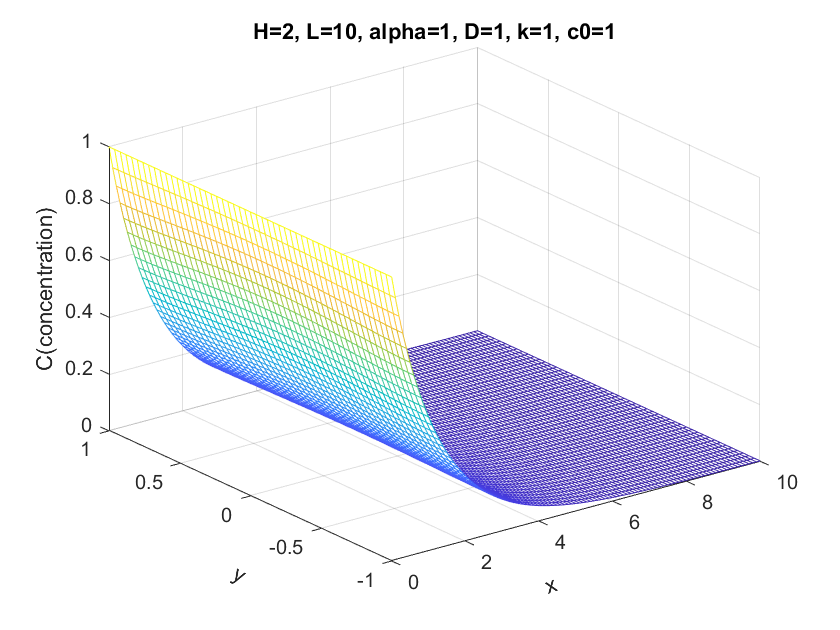

# ENM502-2021-hw4
#### Introduction

In this homework, we are going to simulate a reactive solute(a fully developed parabolic flow) in a rectangular channel with FEM(finite element method).

The equation of the flow could be described as 
$$
v(y) \frac{\partial c}{\partial x}=D \nabla^{2} c-k c
$$
where `v` is is the parabolic flow velocity profile
$$
v(y)=\alpha\left(\frac{H^{2}}{4}-y^{2}\right)
$$
`D` is the solute diffusion coefficient and `k` is the (first order) reaction rate constant. 

#### Problem Setup and Formulation Finite Element Method

1. Derive the **Weak form** by applying the **Galerkin's** method
2. Use FEM to divide the whole grid into elements with unit grid.
3. Use bilinear elements and express all integrals in terms of integrals over the unit element.
4. Then we use `3x3` **Gaussian quadrature** to evaluate the intergral.

#### Problem Setup and Formulation Weak form of PDE

#### Problem Setup and Formulation Gaussian Quadrature

3x3 Gaussian quadrature

#### Result and Discussions Plots and comparison between different parameters

The basic condition is ` α = 1; D = 1; k = 1 H = 2 and L = 10`

|   |   |
| ---------------------------- | ---------------------------------- |
|  |  |
|                              |                                    |
|                              |                                    |

#### Result and Discussions Accuracy

#### Conclusion

#### Code

Github [link](https://github.com/Jack12xl/ENM502-2021-hw4)

##### Reference:

http://users.metu.edu.tr/csert/me582/ME582%20Ch%2003.pdf

##### Contributors

[Ling Xie](https://github.com/Jack12xl),

Siyu Zhao()